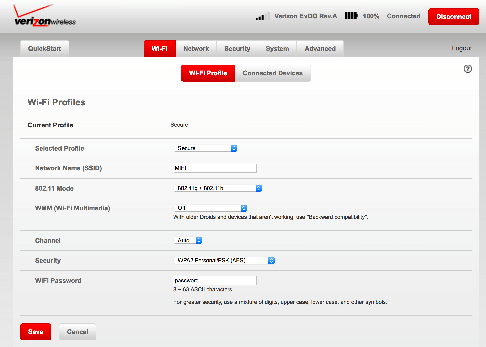

#  Novatel Wireless MIFI 4620 modem - auto reconnecting script
The script makes internet connection with your MIFI modem more reliable.
In case of any connection problem it sends Reconnecting command to Disconnect/Connect the upstream link.

The script is tested on [Novatel Wireless MIFI 4620LE](http://www.nvtl.com/products/mobile-broadband-solutions/mifi-intelligent-mobile-hotspots/mifi-4620le-3g4g-lte-global-intelligent-mobile-hotspot/) modem ([datasheet](docs/Novatel_4620LE.pdf)). The admin panel in my case looks like this:



## Prerequisites
- Novatel Wireless MIFI 4620 modem (with Verizon admin panel)
- PC with Linux OS (connected to modem 24/7)

## How it works
First of all script checks the link to MIFI modem with _wget_ command.
If it's OK, tries to connect with _wget_ to specified external web resource.

If it's OK - just exit, else - execute PHP script which communicates with modem API and make reconnecting.

All actions are logged in console.

## Dependencies
The script uses shell wget and PHP, so install all required dependency packages.
- for _deb_ package management Linux (Debian-based):
```
sudo apt-get install git wget php php5-curl
```
- for _rpm_ package management Linux (RedHat-based):
```
sudo yum install git wget php php5-curl
```

## Installation

### Manual usage
To use the script manually follow next steps.
- Clone the repository:
```
git clone https://github.com/acidtron/novatel-wireless-reconnect.git
```
- Move to project directory:
```
cd novatel-wireless-reconnect
```
- Run the command:
```
./inet_reconnect.sh "CHECK_ADDRESS" "MODEM_ADDRESS" "MODEM_PASSWORD"
```
where:
- CHECK_ADDRESS - the URL to external web resource, for ex: https://google.com
- MODEM_ADDRESS - the URL to modem admin panel, for ex: http://192.168.1.1
- MODEM_PASSWORD - modem admin panel password

### Automatic execution
To use the script in automatic mode perform actions described below.
- Clone the repository:
```
sudo git clone https://github.com/acidtron/novatel-wireless-reconnect.git /opt/nwr
```
- Add entry to the `/etc/crontab` file:
```
*/5 * * * * root /opt/nwr/inet_reconnect.sh "https://google.com" "http://192.168.1.1" "password" >> /var/log/inet_reconnect.log
```
Actually, it's not desired to be a root to execute the script, so change in your own.

- Apply the cron changes:
```
sudo service cron reload
```

## Contributing
You can change this script according to your modem device. This is just the idea to solve connection drops.

Report bugs, request features, and suggest improvements [on Github](https://github.com/acidtron/novatel-wireless-reconnect/issues).

Or better yet, [open a pull request](https://github.com/acidtron/novatel-wireless-reconnect/compare) with the changes you'd like to see.
